# GRAFOS 02 - HACKERRANK PROBLEM

**Conteúdo da Disciplina**: Grafos 02

## Sobre

Este projeto consiste na resolução de questões da plataforma HackerRank variando nas dificuldades de médio e difícil. O objetivo é utilizar o conteúdo estudado.

## Questões

</head>
<body>

<table>
    <thead>
        <tr>
            <th>Questão</th>
            <th>Nível</th>
        </tr>
    </thead>
    <tbody>
        <tr>
            <td><a href="https://www.hackerrank.com/challenges/primsmstsub/problem" target="_blank">Prim's (MST) : Special Subtree</td>
            <td>Médio 01</td>
        </tr>
        <tr>
            <td><a href="https://www.hackerrank.com/challenges/dijkstrashortreach/problem" target="_blank">Dijkstra: Shortest Reach 2</td>
            <td>Difícil 01</td>
        </tr>
        <tr>
            <td><a href="https://www.hackerrank.com/challenges/floyd-city-of-blinding-lights/problem?isFullScreen=true" target="_blank">Floyd City of Blinding Lights</td>
            <td>Difícil 02</td>
        </tr>
        <tr>
            <td><a href="https://www.hackerrank.com/challenges/minimum-mst-graph/problem?isFullScreen=true" target="_blank">Minimum MST Graph</td>
            <td>Difícil 03</td>
        </tr>
    </tbody>
</table>

</body>
</html>

## Contribuidores

</head>
<body>

<table>
    <thead>
        <tr>
            <th>Matrícula</th>
            <th>Nome</th>
            <th>GitHub</th>
        </tr>
    </thead>
    <tbody>
        <tr>
            <td>202046102</td>
            <td>Felipe das Neves Freire</td>
            <td><a href="https://github.com/FelipeFreire-gf" target="_blank">Felipe</a></td>
        </tr>
        <tr>
            <td>222037700</td>
            <td>Leonardo de Melo Lima</td>
            <td><a href="https://github.com/leozinlima" target="_blank">Leonardo</a></td>
        </tr>
    </tbody>
</table>

</body>
</html>

## Linguagem Utilizada

- Python

## Uso

Entrar na plataforma [HackerRank](https://www.hackerrank.com/dashboard), procurar pelo nome/número do exercício, colar na aba code e clicar em _Run Code_

## Screenshots do HackerRank

  
<b>Figura 1: Resultados questão difícil HackerRank Shortest Reach 2</b>

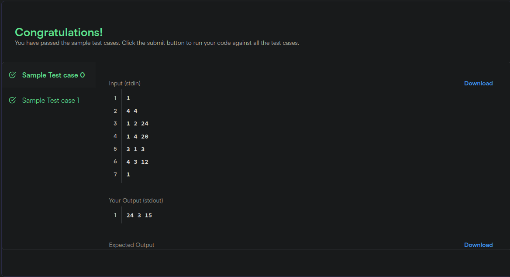

  
<b>Figura 2: Resultados questão difícil HackerRank Shortest Reach 2</b>

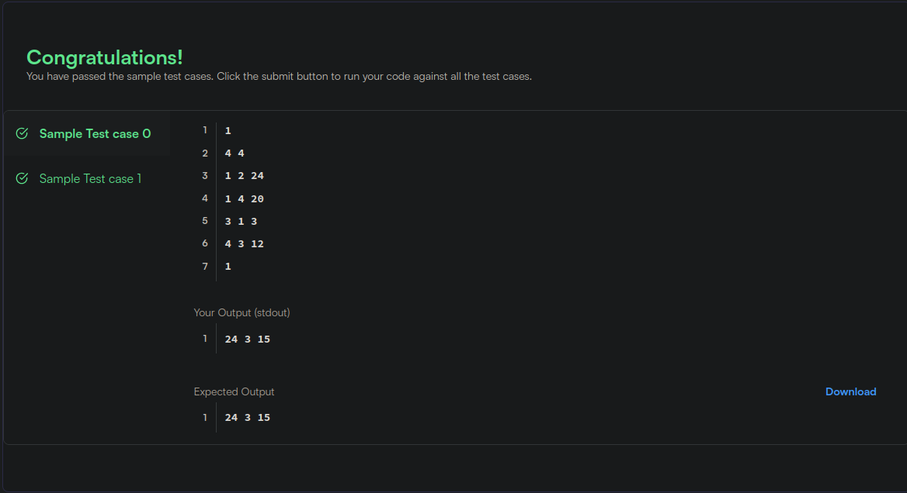

  
<b>Figura 3: Resultados questão difícil HackerRank Shortest Reach 2</b>

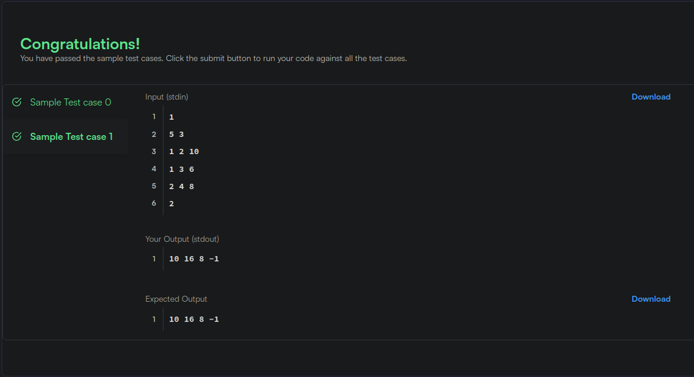

  
<b>Figura 4: Resultados questão média HackerRank Special Subtree</b>

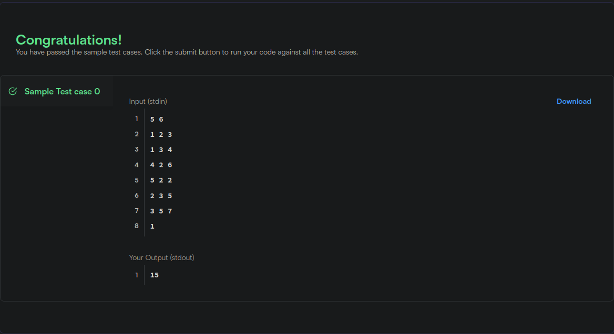

  
<b>Figura 5: Resultados questão média HackerRank Special Subtree</b>

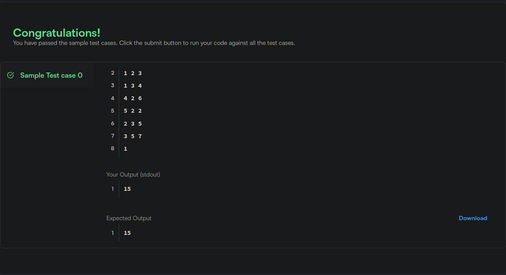

  
<b>Figura 6: Resultados questão difícil HackerRank MST</b>

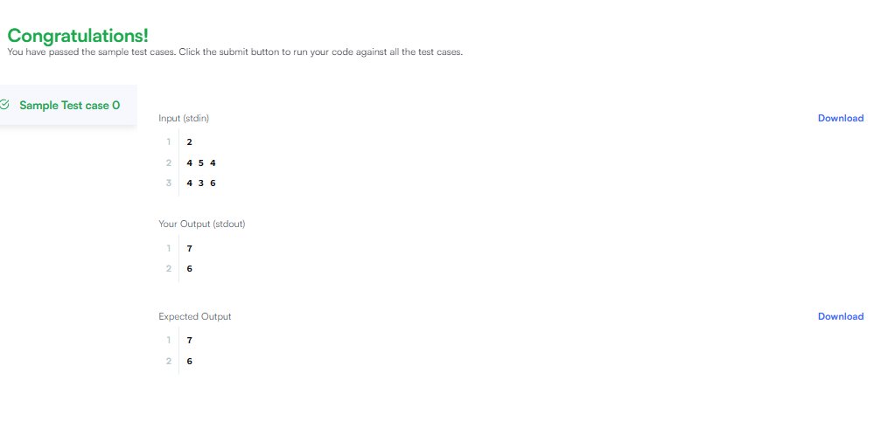

  
<b>Figura 7: Resultados questão difícil HackerRank Floyd</b>

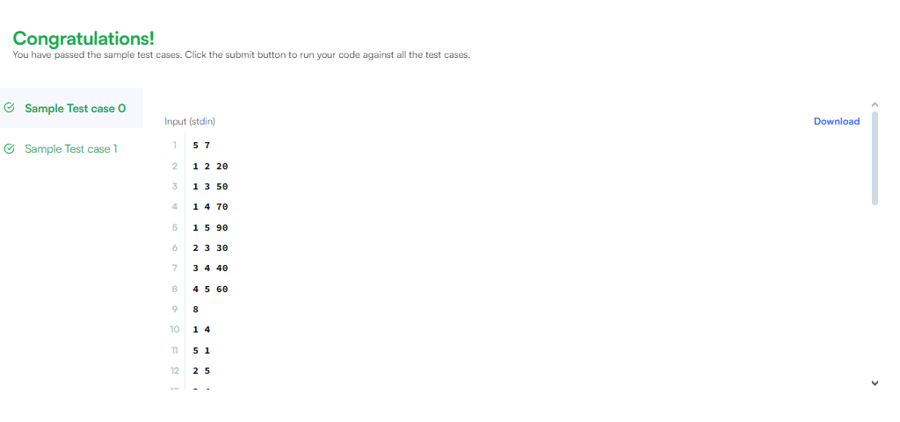

  
<b>Figura 8: Resultados questão difícil HackerRank Floyd</b>

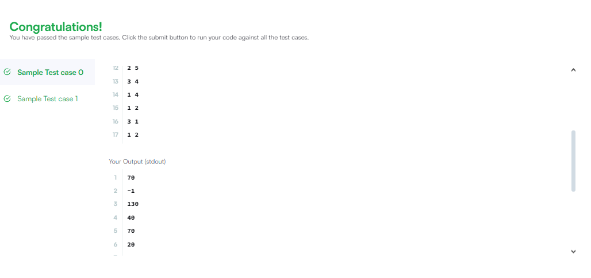

  
<b>Figura 9: Resultados questão difícil HackerRank Floyd</b>

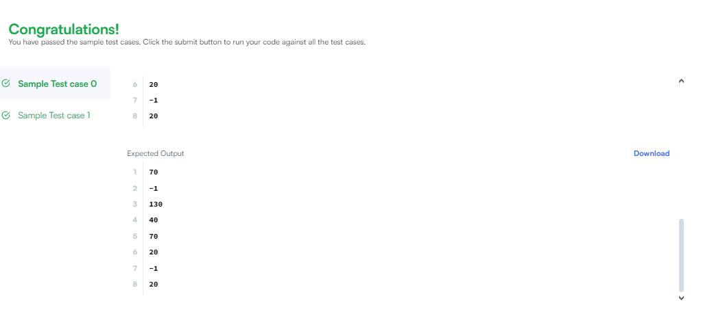

  
<b>Figura 10: Resultados questão difícil HackerRank Floyd</b>

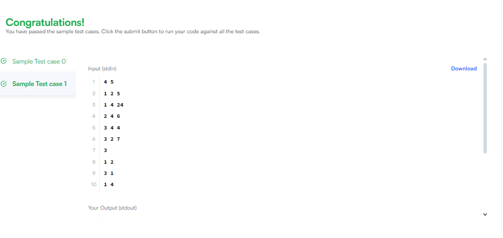

  
<b>Figura 11: Resultados questão difícil HackerRank Floyd</b>

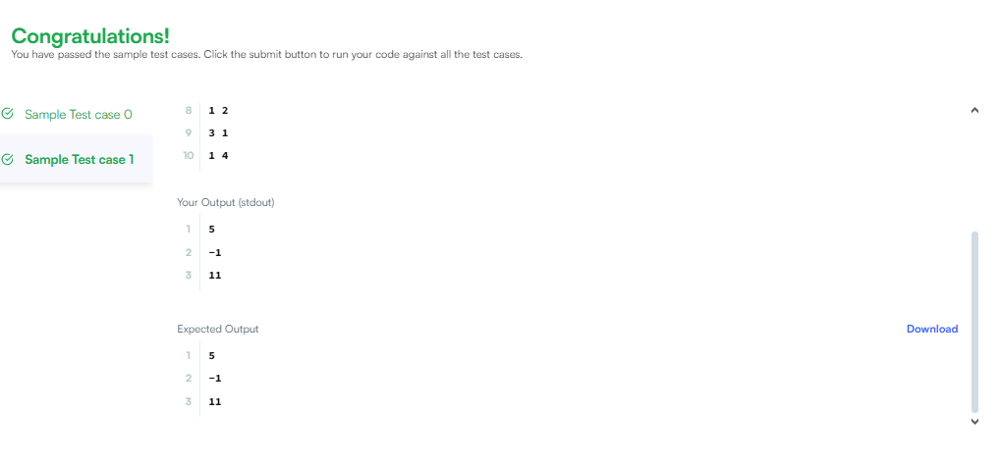

## Vídeo

Explicamos todos os códigos que fizemos na plataforma HackerRank:

</head>
<body>

<table>
    <thead>
        <tr>
            <th>Vídeo 01</th>
        </tr>
    </thead>
    <tbody>
        <tr>
            <td><a href="https://youtu.be/IYYoHstUyWE" target="_blank">HackerRank Problem</a></td>
        </tr>
    </tbody>
</table>

</body>
</html>
